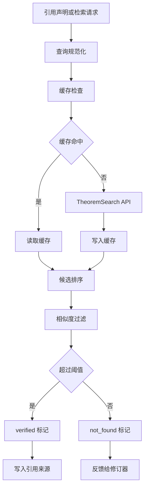
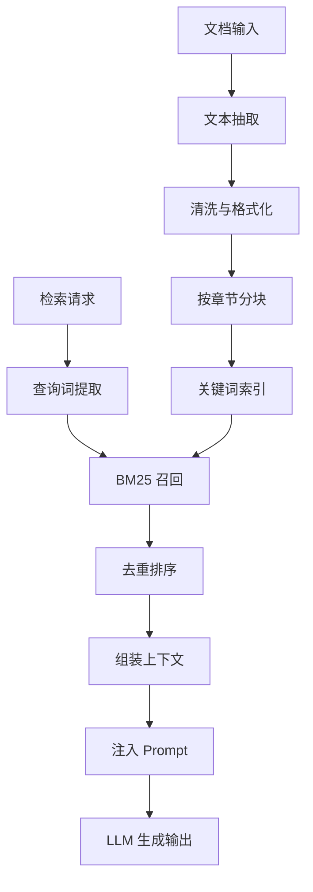
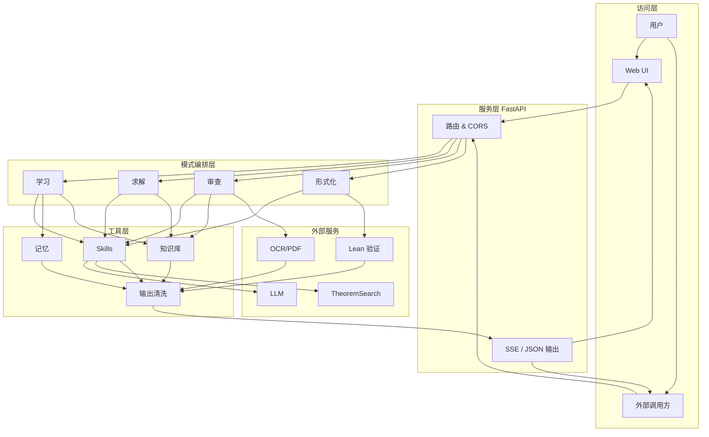

# vibe_proving 产品介绍

## 1. 产品概述

`vibe_proving` 是一个面向数学学习、研究与证明验证场景的 AI 推理系统。它以自然语言数学输入为起点，结合大语言模型、定理检索、证明验证、论文解析与流式交互能力，提供从“理解问题”到“生成证明”、从“审查论文”到“自动形式化”的一体化工作流。

产品定位是“数学工作者的推理伙伴”：既服务于学生和自学者的分层讲解，也服务于研究者、教师和论文作者对证明严谨性、引用可靠性和形式化可验证性的需求。

## 2. 目标用户与使用场景

### 2.1 学生与自学者

学生可以输入一个数学命题或证明目标，系统根据学习阶段生成分层讲解，包括前置知识、关键定义、证明思路、具体例子和延伸方向。与通用聊天机器人相比，`vibe_proving` 更强调数学结构、证明步骤和知识依赖关系。

典型场景：

- 解释抽象代数、数论、拓扑等课程中的定理。
- 将高阶证明拆解成适合本科或研究生水平理解的步骤。
- 根据用户所在项目或书本上下文，持续追踪学习进度。

### 2.2 数学研究者与教师

研究者可以将自然语言命题提交给系统，由系统执行检索、证明生成、验证和修订循环。教师可以借助系统检查证明作业中的逻辑跳步、引用错误和表述不严谨处。

典型场景：

- 为研究级数学问题生成证明蓝图。
- 对证明草稿进行逻辑审查和逐步验证。
- 检查引用定理是否存在、是否与当前结论匹配。

### 2.3 论文作者与审稿辅助

系统支持对论文文本、LaTeX 片段和 PDF 上传内容进行解析和审查，围绕定理、引理、证明和引用展开结构化检查。该能力适合在正式投稿前进行预审，也适合辅助审稿人定位潜在漏洞。

典型场景：

- 从论文中抽取定理和证明段落。
- 检查证明中的逻辑缺口、符号不一致和未验证引用。
- 对长 PDF 进行章节化解析与审查。

### 2.4 Lean 形式化用户

系统包含自动形式化能力，可将自然语言命题转换为 Lean/mathlib 代码，并通过检索、规划、生成、验证和修复等阶段提升可编译概率。该能力目前更适合作为 Beta 功能，用于探索自然语言数学与形式化证明之间的桥接。

## 3. 核心功能

### 3.1 学习模式

学习模式面向教学解释。用户输入数学命题后，系统会生成结构化讲解，重点不是直接给出最短答案，而是帮助用户理解“为什么这样证明”。

主要能力包括：

- 前置知识梳理：识别理解该命题所需的定义、定理和背景。
- 分层证明讲解：根据本科、研究生等水平调整表述深度。
- 例子驱动理解：用具体对象辅助解释抽象结论。
- 长期上下文：可与项目、书本和用户学习轨迹结合。

学习模式流程图：

```mermaid
flowchart TD
    A[命题输入] --> B[/learn 路由]
    B --> C{项目上下文}
    C -- 有 --> D[LATRACE 记忆检索]
    C -- 无 --> E[构造教学任务]
    D --> F[合并用户上下文]
    E --> F
    F --> G[前置知识图谱]
    G --> H[证明主线规划]
    H --> I[分层生成讲解]
    I --> J[补充例子与延伸]
    J --> K[LaTeX 清洗]
    K --> L[SSE 流式返回]
    K --> M[异步写入记忆]
```

### 3.2 研究求解模式

研究求解模式面向更高难度的自然语言数学问题。系统采用 Generator-Verifier-Reviser 思路：先生成证明，再由独立验证环节审查，再根据反馈修订。

该模式的关键设计包括：

- 直接检索：优先检索是否已有高相似度定理或结论。
- 证明生成：调用数学推理模型生成证明草案。
- 独立验证：验证器不共享生成器的隐藏推理链，降低自我确认偏差。
- 引用核查：通过 TheoremSearch 检查引用定理是否真实存在且相关。
- 反例测试：在必要时尝试构造反例，避免对错误命题强行证明。
- 主动拒绝：置信度不足时返回无可靠解，而不是编造证明。

研究求解流程图：

```mermaid
flowchart TD
    A[数学问题输入] --> B[/solve 路由]
    B --> C[Phase 0 直接检索]
    C --> D{命中高相似度}
    D -- 是 --> E[direct_hit 返回]
    D -- 否 --> F[Phase 1 生成证明]
    F --> G[独立步骤验证]
    G --> H[引用核查]
    H --> I{验证通过}
    I -- 是 --> J[proved 输出]
    I -- 否 --> K{达到修订上限}
    K -- 否 --> L[注入错误修订]
    L --> F
    K -- 是 --> M[Phase 1.5 反例测试]
    M --> N{发现反例}
    N -- 是 --> O[counterexample]
    N -- 否 --> P[Phase 2 子目标分解]
    P --> Q[Phase 3 全局验证]
    Q --> R{置信度达标}
    R -- 是 --> S[蓝图与引用输出]
    R -- 否 --> T[No confident solution]
```

### 3.3 论文与证明审查

审查模式关注严谨性、可追溯性和可解释反馈。系统可以处理粘贴文本、LaTeX、图片和 PDF 上传，并输出结构化审查报告。

审查维度包括：

- 逻辑完整性：检查证明步骤是否存在跳步、循环论证或不成立推导。
- 引用可靠性：核查引用定理是否能被外部检索服务匹配。
- 符号一致性：识别变量、符号、假设和结论之间的不一致。
- 章节化处理：对较长 PDF 按章节或大块内容拆解审查，降低长上下文风险。
- 流式反馈：长任务执行过程中持续返回状态和中间结果。

论文与证明审查流程图：

```mermaid
flowchart TD
    A[输入内容] --> B[/review 路由]
    B --> C{输入类型}
    C -- 文本/LaTeX --> D[解析定理环境]
    C -- 图片 --> E[OCR 文本抽取]
    C -- PDF --> F[多路 OCR 解析]
    F --> G[章节切分]
    D --> H[命题单元抽取]
    E --> H
    G --> H
    H --> I[审查任务编排]
    I --> J[逻辑一致性]
    I --> K[引用核查]
    I --> L[符号一致性]
    J --> M[问题归并]
    K --> M
    L --> M
    M --> N[严重程度分级]
    N --> O[结构化审查报告]
    O --> P[流式状态返回]
```

### 3.4 自动形式化

自动形式化模块尝试将自然语言数学命题转化为 Lean 代码。系统采用多阶段流水线，而不是一次性生成代码。

主要阶段包括：

- 关键词抽取：从自然语言命题中识别数学对象、结构和目标。
- mathlib 检索：查找相关定义、定理和可复用代码片段。
- 蓝图规划：生成 Lean 形式化策略和证明结构。
- 候选代码生成：输出 Lean/mathlib 代码。
- 验证执行：调用远程或本地验证器检查代码。
- 自动修复：根据编译错误或验证反馈进行多轮修复。

自动形式化架构图：

```mermaid
flowchart TD
    A[自然语言命题] --> B[/formalize 路由]
    B --> C{修复模式}
    C -- 是 --> D[载入现有代码]
    C -- 否 --> E[关键词抽取]
    E --> F{跳过检索}
    F -- 否 --> G[mathlib 检索]
    F -- 是 --> H[空检索上下文]
    G --> I[候选定义与定理]
    I --> J[蓝图规划]
    H --> J
    D --> J
    J --> K[Lean 代码生成]
    K --> L[Kimina/本地验证]
    L --> M{验证通过}
    M -- 是 --> N[Lean 代码输出]
    M -- 否 --> O[错误分类]
    O --> P{达到上限}
    P -- 是 --> Q[partial/error 输出]
    P -- 否 --> R{需要重规划}
    R -- 是 --> J
    R -- 否 --> S[局部修复]
    S --> L
```

### 3.5 定理检索与引用防幻觉

系统集成 TheoremSearch，用于数学定理检索和引用核查。该能力是区别于通用 LLM 数学问答的重要组成部分：模型给出的引用不会被默认信任，而是需要经过外部检索验证。

核心价值：

- 降低虚构定理、错误命名和错误引用风险。
- 为证明结果提供可追溯来源。
- 支撑论文审查和研究求解中的事实核查。

定理检索与引用核查流程图：



### 3.6 知识库与低成本检索

项目内置轻量知识库能力，支持文本抽取、分块和 BM25 式关键词检索。该方案无需额外向量数据库，适合本地部署、低成本试验和中小规模数学文档集管理。

知识库检索架构图：



## 4. 技术架构

### 4.1 总体架构

系统采用前后端分离但部署简单的架构：



### 4.2 后端服务

后端使用 FastAPI 实现，统一承载 API、健康检查、静态前端托管和长任务流式输出。主要端点包括：

- `POST /learn`：学习模式。
- `POST /solve`：研究求解模式。
- `POST /review`、`POST /review_stream`：证明或论文审查。
- `POST /review_pdf_stream`：PDF 上传审查。
- `POST /formalize`：自然语言到 Lean 的自动形式化。
- `GET /search`：TheoremSearch 定理检索。
- `GET /health`：服务与依赖健康检查。

### 4.3 前端界面

前端采用原生 HTML、CSS 和 JavaScript 实现，降低构建复杂度和部署门槛。UI 通过后端 `/ui/` 路径静态托管，支持学习、求解、审查、文件上传和流式结果展示等交互。

### 4.4 LLM 接入

系统通过 OpenAI 兼容接口接入模型服务，支持按配置切换不同模型。形式化模块还支持按阶段配置模型，例如关键词抽取、规划、生成和修复可以使用不同模型，以便在成本与效果之间取得平衡。

技术特点：

- 支持流式输出和非流式 JSON 输出。
- 支持超长输入截断与结构化响应解析。
- 支持多模型路由和部署侧替换。
- 对用户可见文本进行 LaTeX 清洗，保留数学公式并剥离不适合前端展示的控制命令。

### 4.5 PDF 与论文解析

系统围绕论文审查场景设计了多路径解析能力。当前 PDF 审查主路径可以接入 Nanonets 异步 OCR，并保留 GROBID、Mathpix、MinerU 等解析后端的配置扩展点。

设计目标：

- 尽量保留数学公式、定理环境和章节结构。
- 对长文档进行分块处理，避免一次性上下文过长。
- 在解析失败时返回明确错误，便于用户重新上传或更换解析策略。

### 4.6 验证与质量控制

系统的质量控制并不只依赖生成模型自身，而是通过多层机制交叉约束：

- TheoremSearch 对引用进行外部核查。
- `verify_sequential` 对证明步骤进行逐步验证。
- `counterexamples` 在关键路径尝试发现反例。
- Lean 验证器检查自动形式化代码。
- 输出清洗模块统一处理面向用户的 LaTeX 与结构化结果。

## 5. 产品优势

### 5.1 面向数学推理，而不是通用问答

`vibe_proving` 的工作流围绕数学任务设计，包括证明生成、引用核查、反例检测、论文审查和 Lean 形式化。它不是简单地把通用聊天模型套在数学问题上，而是将模型能力放入可审查、可验证、可追溯的流程中。

### 5.2 研究级能力与开源可用性结合

当前竞品中，部分系统具备较强研究能力但不可用或不可商用；另一些工具偏向文献管理或符号计算，无法覆盖抽象证明推理。`vibe_proving` 的机会在于将研究级数学推理流程做成可部署、可迭代、可扩展的开源产品。

### 5.3 降低幻觉风险

系统通过检索、验证和主动拒绝机制降低幻觉风险。尤其在数学场景中，一个虚构定理或错误引用会严重破坏结果可信度，因此引用核查和验证闭环是产品设计的核心。

### 5.4 低成本和可替换部署

产品支持 OpenAI 兼容模型接口，便于接入不同云厂商、代理服务或本地模型。知识库检索不强依赖向量数据库，前端也不依赖复杂构建工具，整体更适合快速部署和低成本试验。

### 5.5 面向未来形式化生态

Lean/mathlib 形式化能力为产品提供了长期技术路线：从自然语言证明辅助，逐步走向机器可验证证明和形式化数学工作流。

## 6. 当前成熟度

| 模块 | 成熟度 | 说明 |
| --- | --- | --- |
| 学习模式 | 可用 | 已具备分层讲解、流式输出和项目上下文能力。 |
| 研究求解 | 可用 / 持续增强 | 已实现生成、验证、修订、引用核查和反例测试流程。 |
| 论文审查 | 可用 / 依赖解析质量 | 支持文本、LaTeX、图片和 PDF，PDF 效果受 OCR/解析后端影响。 |
| 自动形式化 | Beta | 已具备多阶段 Lean 生成与验证修复流程，仍需扩大题库评测。 |
| 长期记忆 | MVP / 可降级 | 可接入 LATRACE，外部服务不可用时核心功能仍可运行。 |
| 项目管理 | MVP | 当前适合本地或演示场景，生产部署建议接入持久化存储。 |

## 7. 测试与工程质量

项目包含覆盖多个功能面的 pytest 测试，包括配置加载、LLM 客户端、学习模式、求解模式、论文审查、形式化 API、外部检索、Verifier、UI 合同和输出格式等。

推荐回归方式：

```bash
cd app
python -m pytest tests -m "not slow"
```

涉及真实 LLM、TheoremSearch、OCR 或远程验证器的测试可能依赖外部服务和 API Key，适合作为集成测试或发布前验收。

## 8. 部署与配置

系统主要配置集中在 `app/config.toml`，包括：

- LLM：OpenAI 兼容接口、模型名、超时设置。
- TheoremSearch：定理检索服务地址和超时。
- LATRACE：长期记忆服务地址与租户信息。
- PDF/OCR：GROBID、Mathpix、Nanonets、MinerU 等解析后端。
- Formalization Models：形式化各阶段模型路由。

生产环境建议通过环境变量或密钥管理系统注入敏感配置，不应将 API Key、Token 或私有服务地址写入公开文档和仓库。

## 9. 路线图建议

短期重点：

- 完善论文审查的 PDF 解析稳定性和错误恢复能力。
- 扩充形式化检索与 Lean 验证题库，建立稳定 benchmark。
- 将项目管理从内存 MVP 升级为持久化存储。
- 建立更明确的模型成本、响应时间和成功率指标。

中期重点：

- 支持团队级知识库和论文项目管理。
- 引入更细粒度的审查报告导出能力。
- 强化 Lean/mathlib 自动形式化的自动修复策略。
- 建立可复现实验集，用于比较不同模型在数学推理、引用核查和形式化任务上的表现。

长期方向：

- 形成从自然语言数学、论文审查到机器可验证证明的一体化工作台。
- 对接更多数学数据库、定理库和形式化证明生态。
- 支持教学、科研和审稿场景下的协作式数学工作流。

## 10. 一页 PPT 版本提纲

如果需要将本文档压缩成一页路演或介绍页，可以采用以下结构：

1. 标题：`vibe_proving - 数学工作者的 AI 推理伙伴`
2. 痛点：通用 LLM 易幻觉，数学证明需要可验证、可追溯、可审查。
3. 方案：学习、求解、论文审查、自动形式化四大模式。
4. 技术闭环：LLM 生成 + TheoremSearch 引用核查 + Verifier 验证 + Lean 形式化。
5. 产品优势：开源可用、低成本部署、流式交互、多模型兼容、面向研究级数学。
6. 当前状态：核心功能可用，形式化 Beta，项目与长期记忆持续增强。
7. 路线图：PDF 审查稳定化、形式化 benchmark、团队知识库、机器可验证证明工作台。
