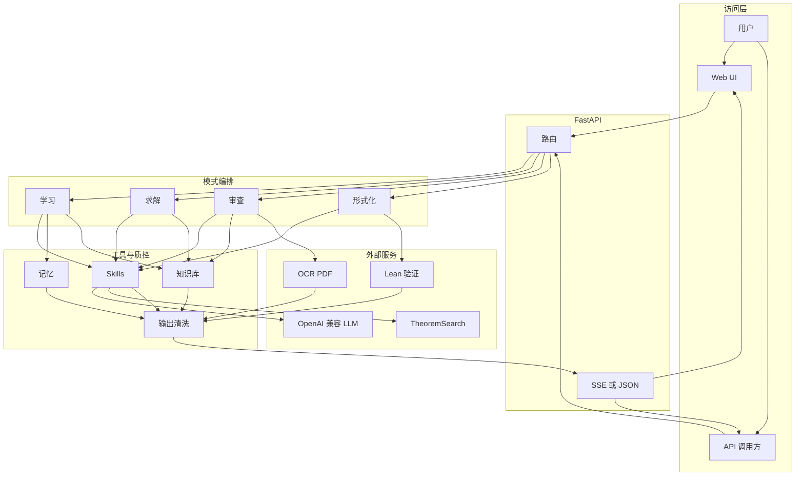

# vibe_proving

面向数学学习、研究与证明验证的多模式 AI 系统：分层讲解、生成–验证–修订式求解、论文与证明审查、定理检索，以及 Lean/mathlib 自动形式化（Beta）。

更完整的产品视角说明见 [PRODUCT_INTRO.md](PRODUCT_INTRO.md)。开发者约定见 [CLAUDE.md](CLAUDE.md)。

## 能力一览

| 能力 | 说明 |
|------|------|
| 学习模式 | 前置知识、分层证明讲解、例子与延伸 |
| 研究求解 | Generator–Verifier–Reviser；TheoremSearch 引用核查；反例与主动拒绝 |
| 论文审查 | 文本 / LaTeX / 图片 / PDF；逻辑、引用、符号一致性；SSE 流式 |
| 自动形式化 | 自然语言 → Lean；检索、蓝图、生成、验证与修复（Beta） |
| 定理检索 | `GET /search` 对接 TheoremSearch |
| 知识库 | 本地文档分块与 BM25 式检索（无强制向量库） |

## 架构（概览）



## API 端点

| 方法 | 路径 | 说明 |
|------|------|------|
| POST | `/learn` | 学习模式；支持 SSE |
| POST | `/solve` | 研究求解；支持 SSE |
| POST | `/review` | 论文/证明审查 |
| POST | `/review_stream` | 审查流式 |
| POST | `/review_pdf_stream` | PDF 上传审查流式 |
| POST | `/formalize` | Lean 形式化（Beta）；SSE |
| GET | `/search` | TheoremSearch 检索 |
| POST | `/projects` | 创建项目（当前 MVP） |
| GET | `/projects` | 列出项目 |
| GET | `/health` | 健康检查与依赖状态 |
| GET | `/docs` | OpenAPI（Swagger UI） |
| — | `/ui/` | 单页前端（静态托管） |

## 快速开始

```bash
cd app
python -m venv .venv
# Windows: .venv\Scripts\activate
# Unix:    source .venv/bin/activate
pip install -r requirements.txt
cp config.example.toml config.toml
# 编辑 config.toml：至少填写 [llm].api_key；按需填写定理检索、OCR、记忆等
python -m uvicorn api.server:app --host 127.0.0.1 --port 8080
```

访问：`http://127.0.0.1:8080/ui/`、`http://127.0.0.1:8080/docs`、`http://127.0.0.1:8080/health`。

### 配置文件路径

- 默认读取 `app/config.toml`（已被 `.gitignore` 忽略，勿提交）。
- 可通过环境变量 `VP_CONFIG_PATH` 指向任意路径的 TOML。
- 测试在未找到 `config.toml` 时会自动从 `config.example.toml` 复制到临时文件并设置 `VP_CONFIG_PATH`。

## 测试

```bash
cd app
python -m pytest tests -m "not slow"
```

完整集成（真实 API / OCR / PDF fixtures）：

```bash
python -m pytest tests -m slow
```

论文 PDF fixture 不包含在仓库中，见 [app/tests/fixtures/paper_review_pdfs/README.md](app/tests/fixtures/paper_review_pdfs/README.md)。

## 仓库结构

| 路径 | 说明 |
|------|------|
| `app/` | 应用代码、前端、测试 |
| `research/` | 设计与调研文档 |
| `PRODUCT_INTRO.md` | 产品介绍与功能流程图 |
| `LICENSE` | MIT |

以下目录**不包含**在公开仓库中（见 `.gitignore`）：`FATE/`、`Archon/`、`Rethlas/`、本地 Lean 环境、评估产物、含密钥的 `app/config.toml`。

## 安全与密钥

- **切勿**将真实 `api_key`、`token` 提交到 git。
- 若曾在本地提交过密钥，请在对应平台**吊销并轮换**，再使用本仓库的干净历史分支推送到 GitHub。

## 致谢与参考

设计与实现参考或集成了以下思路与生态（详见 `research/`）：

- [TheoremSearch](https://www.theoremsearch.com) — 定理检索与引用核查
- Aletheia（arXiv:2602.10177）— Generator–Verifier–Reviser
- [LATRACE](https://github.com/zxxz1000/LATRACE) — 可选长期记忆
- [Rethlas](https://github.com/frenzymath/Rethlas)、[Archon](https://github.com/frenzymath/Archon) — 架构启发（本仓库不包含其源码）

## 协议

本项目以 [LICENSE](LICENSE)（MIT）授权。

## 推送到 GitHub（仅公开干净历史）

本仓库的 **`public/main`** 分支为 orphan 根提交（`chore: initial public release`），不含旧历史中可能泄漏的密钥。推送时**只推该分支**到远端默认分支即可：

```bash
git remote add origin https://github.com/<org>/<repo>.git   # 若尚未添加
git push -u origin public/main:main
```

本地仍保留旧分支与对象时，请勿执行 `git push --mirror` 或推送整个 `.git` 到公开位置。若曾在旧提交中使用过真实 API Key / Token，请到各服务商控制台**吊销并轮换**。
